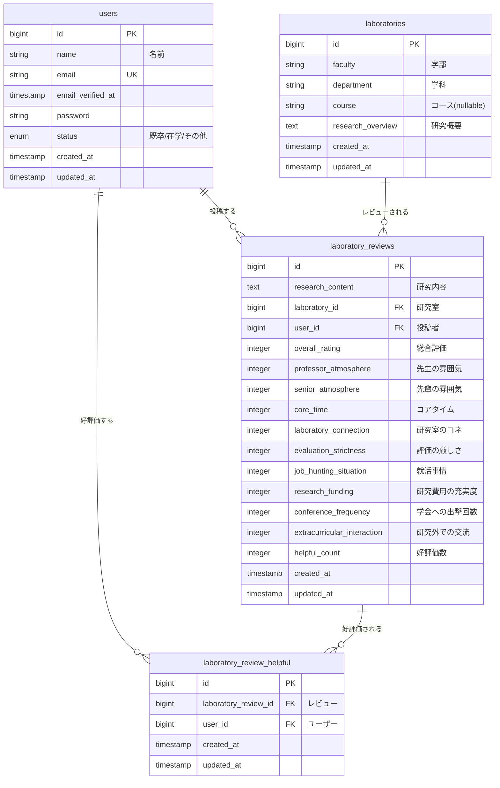

# ER図 - 研究室口コミシステム

## リレーションシップ説明

### users (ユーザーDB)
- **1対多**: 1人のユーザーは複数の投稿(laboratory_reviews)を持つ
- **多対多**: ユーザーは複数の投稿に好評価をつけることができる(laboratory_review_helpful経由)

### laboratories (研究室DB)
- **1対多**: 1つの研究室は複数のレビュー(laboratory_reviews)を持つ

### laboratory_reviews (投稿DB)
- **多対1**: 複数のレビューは1つの研究室(laboratories)に属する
- **多対1**: 複数のレビューは1人のユーザー(users)によって投稿される
- **1対多**: 1つのレビューは複数の好評価(laboratory_review_helpful)を持つ

### laboratory_review_helpful (好評価中間テーブル)
- **多対1**: 複数の好評価は1つのレビュー(laboratory_reviews)に属する
- **多対1**: 複数の好評価は1人のユーザー(users)によって付けられる
- **制約**: 同じユーザーが同じレビューに複数回好評価をつけられない(unique制約)

## キー制約

- `laboratory_reviews`: (laboratory_id, user_id) の組み合わせがユニーク（1人のユーザーは1つの研究室に対して1つのレビューのみ）
- `laboratory_review_helpful`: (laboratory_review_id, user_id) の組み合わせがユニーク（1人のユーザーは1つのレビューに対して1回のみ好評価可能）
