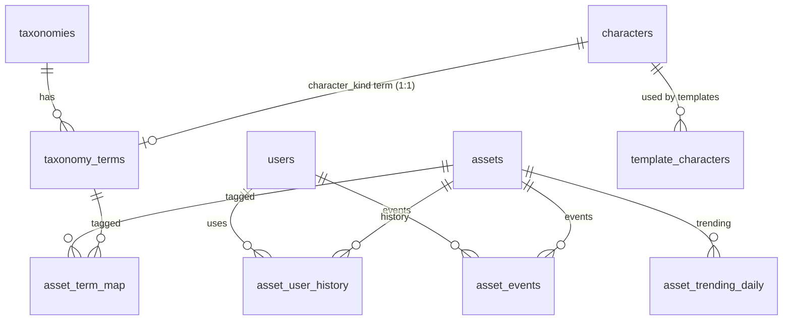

# YapClip 素材選択UI向け APIレスポンス例（JSON）サンプル集
（キャラクター / 小物・背景・演出 / BGM・効果音）

> 目的：先方が「この画面が、APIから何を受け取って、どう描画するか」を一目で想像できるようにする  
> 前提：素材本体は **assets**、分類（タブ/タグ）は **taxonomies / taxonomy_terms**、履歴/急上昇は **history / trending** を正本にする  
> 追加（今回）：既存の **characters** を残し、**character_kind**（taxonomy）と **1:1 で紐付け**て整合を取る

---

## URL生成ルール（DBにURLは保存しない）

- `assets` テーブルに保存するのは **object_key / thumbnail_object_key**（= R2 の object key）だけ
- `characters` テーブルに保存するのも **image_object_key / thumbnail_object_key**（= R2 の object key）だけ（URL列は使わない）
- APIレスポンスで返す `source_url` / `thumbnail_url` / `image_url` は **DBのURL列ではなく**、以下のルールで **サーバー側で生成**する  
  - `source_url = <R2_PUBLIC_DOMAIN>/<object_key>`
  - `thumbnail_url = <R2_PUBLIC_DOMAIN>/<thumbnail_object_key>`
  - `character.image_url = <R2_PUBLIC_DOMAIN>/<character.image_object_key>`

> 注：Phase1（DB/seed）では URL生成ロジック自体は未実装でもOK。  
> ただし「DBにURLを入れない」前提で seed/設計書/実装を統一する。

---

## リレーション図（assets / taxonomy / characters）



---

## characters と assets の役割分担（最小で整合を取る）

- **characters**：キャラ「種別」の正本（パンダ/うさぎ…）
  - `templates` は既に `template_characters.character_id -> characters.id` を参照しているため、ここを正にする
- **assets(asset_type=character)**：キャラ素材の正本（泣きパンダ/笑いパンダ…＝表情差分ごとに別assets）
- **character_kind taxonomy**：UIのドロップダウン/フィルタの正本
  - `taxonomy_terms(character_kind).character_id -> characters.id` で 1:1 紐付けし、UIとtemplatesを同じ “characters” に揃える

> これにより、assets側に `character_id` カラムを追加しなくても  
> `assets -> asset_term_map -> taxonomy_terms(character_kind) -> characters` で辿れる（Phase1での変更最小）。

---

## 1. 画面とDBの紐づき（超要約）
### コマ編集：キャラクター選択（例）
- 画面の **丸いサムネ一覧** → `assets`（`asset_type=character`）
  - `thumbnail_url`：一覧サムネ（API生成）
  - `source_url`：配置する実体画像（API生成）
  - `is_premium`：ロック表示
- 画面の **キャラ種別（パンダ/うさぎ…）** → taxonomy（`character_kind`）
  - term（panda/rabbit…）は `taxonomy_terms.character_id` で **charactersと1:1紐付け**（templatesとの整合）
- 画面の **「すべて / どうぶつ / 赤ちゃん」**（シリーズ的なタブ） → taxonomy（`character_series`）
- 画面の **感情タグ（泣き/笑い/怒り/困り…）** → taxonomy（`character_emotion`）
- 画面の **動作タグ（ジャンプ/走る…）** → taxonomy（`character_action`）
- 画面の **履歴 / 急上昇** → `asset_user_history` / `asset_trending_daily`（生成元は `asset_events`）

> 検索のルール（UI複数選択に合わせる）
- **同じ分類内は OR**（例：感情=泣き＋笑い → 泣き *または* 笑い）
- **分類が違えば AND**（例：キャラ=パンダ *かつ* 感情=泣き）

---

## 2. API一覧（MVP）
- `GET /asset/taxonomies?asset_type=character`  
  → タブ/タグ/ドロップダウンの候補（分類マスタ）
- `GET /assets?asset_type=character&q=...&filters[...]&sort=...&page=...`  
  → 丸いサムネ一覧（検索/絞り込み）
- `POST /assets/{id}/used`  
  → 履歴・急上昇の記録（押下/配置のタイミングで送る）
- `GET /assets/history?asset_type=character`  
  → 履歴タブ
- `GET /assets/trending?asset_type=character&days=7`  
  → 急上昇タブ
- （任意/別枠）`GET /characters`  
  → templates等で「登場キャラ一覧」が必要な場合（画像URLはAPI生成）

---

# 3. APIレスポンス例（JSON）

## 3.1 分類（タブ/タグ）取得：キャラクター用
（略：v2と同じ。`character_kind` term は内部的に `characters` と紐付いている前提）

---

## 3.7 使用イベント：素材を使った通知（履歴/急上昇の元）
（略：v2と同じ）

---

# 6. セットアップ完了条件SQL（DB/seedの確認）

> `make db-reset && make db-bootstrap` が通ったら、以下のSQLで「必要テーブルが揃い、seedが入り、URL非保持（object_key正本）が守られている」ことを確認する。

### 6.1 テーブル存在確認（ERDの関連テーブル一式 + characters）
```bash
docker compose exec -T postgres psql -U yapclip -d yapclip -c "
SELECT
  to_regclass('public.assets')               AS assets,
  to_regclass('public.taxonomies')           AS taxonomies,
  to_regclass('public.taxonomy_terms')       AS taxonomy_terms,
  to_regclass('public.asset_term_map')       AS asset_term_map,
  to_regclass('public.asset_user_history')   AS asset_user_history,
  to_regclass('public.asset_events')         AS asset_events,
  to_regclass('public.asset_trending_daily') AS asset_trending_daily,
  to_regclass('public.characters')           AS characters,
  to_regclass('public.template_characters')  AS template_characters
;"
```

### 6.2 URL非保持（object_key / character image_object_key）確認
```bash
# assets: object_key が NULL/空で残っていないか（必須）
docker compose exec -T postgres psql -U yapclip -d yapclip -c "
SELECT COUNT(*) AS bad_object_key
FROM assets
WHERE object_key IS NULL OR object_key = '';
"

# characters: image_object_key が NULL/空で残っていないか（運用上は必須にしたい）
docker compose exec -T postgres psql -U yapclip -d yapclip -c "
SELECT COUNT(*) AS bad_character_object_key
FROM characters
WHERE image_object_key IS NULL OR image_object_key = '';
"
```

### 6.3 character_kind term と characters の 1:1 紐付け確認（推奨）
```bash
# taxonomy_terms.character_id が入っているか（character_kindのみ）
docker compose exec -T postgres psql -U yapclip -d yapclip -c "
SELECT
  COUNT(*) FILTER (WHERE tt.character_id IS NULL) AS missing_character_id,
  COUNT(*) AS total_terms
FROM taxonomy_terms tt
JOIN taxonomies tx ON tx.id = tt.taxonomy_id
WHERE tx.asset_type='character' AND tx.code='character_kind';
"
```
