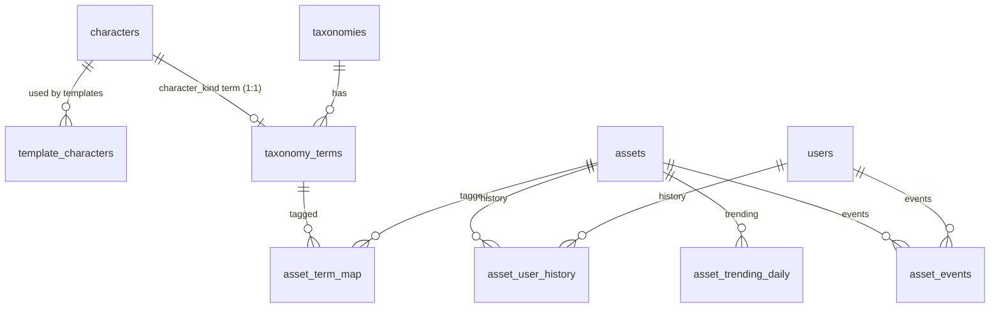

# yapclip_db_design_assets.updated.v2.md（アセットマスタ基盤 / assets・taxonomy・characters）

## 目的
コマ編集画面のアセット選択（キャラ/小物/背景/演出/BGM/効果音）で必要になる、
- 分類（カテゴリ/タグ）
- 検索（キーワード + 条件）
- 履歴（最近/頻度）
- 急上昇（trending）
- プレミアム制御（ロック表示）

を **共通のアセットカタログ基盤**としてDBで扱えるようにする。  
加えて、既存の **characters**（テンプレが参照している）と矛盾しない形で、キャラ選択UI（character_kind）と整合を取る。

---

## 固定ルール（一次資料の前提）
- ローカルも **Cloudflare R2 前提**
- **DBにURLは保存しない**
  - assets の正：`asset_key + object_key (+ tags)`
  - characters の正：`key + image_object_key (+ thumbnail_object_key)`
- APIが `R2_PUBLIC_DOMAIN + "/" + object_key`（charactersは `image_object_key`）で URL を生成して返す

---

## 用語
- **asset_type**: アセット種別  
  `character | object | background | effect | bgm | sfx`
- **taxonomy(kind=category)**: 画面のタブ/単一カテゴリ（例: シリーズ、カテゴリ1）
- **taxonomy(kind=tag)**: チップ/複数選択タグ（例: 感情、動作、特徴）
- **character（charactersテーブル）**: キャラ「種別」正本（panda/rabbit…）

---

## 役割分担（最小で整合を取る）

### assets（素材本体）
- キャラ素材も含め、表情/動作差分は **別assets**（例：泣きパンダ / 笑いパンダ）
- **URLは保持しない**（`object_key`, `thumbnail_object_key` を保持）

### characters（キャラ種別の正本）
- templatesは既に `template_characters.character_id -> characters.id` を参照しているため、ここを正にする
- **URLは保持しない**（`image_object_key`, `thumbnail_object_key` を保持）
- `key`（例：panda）を追加して **安定参照**できるようにする（UIのterm_keyと揃える）

### character_kind taxonomy（UIフィルタの正本）
- `taxonomy_terms(character_kind).character_id -> characters.id` で **1:1 紐付け**
- これにより templates と UI が同じ characters を参照できる

> Phase1での変更最小：assetsに `character_id` を持たせず、taxonomy_terms から辿れる設計にする。

---

## リレーション（ERD）

---

## テーブル一覧（assets基盤）
- `assets`：アセット本体（共通）
- `taxonomies`：分類の枠（種類）
- `taxonomy_terms`：分類の項目（ここに `character_id` を追加）
- `asset_term_map`：アセットと分類項目の紐付け（多対多）
- `asset_user_history`：ユーザー別履歴（最近/頻度）
- `asset_events`：イベントログ（急上昇/分析用）
- `asset_trending_daily`：急上昇用 日次集計

既存（関連）
- `characters`：キャラ種別
- `template_characters`：テンプレとキャラの紐付け

---

## テーブル定義（要点）

### assets（アセット本体）
- 主キー: `id`
- 一意: `asset_key`（全体一意）
- **正本**: `object_key`（必須）、`thumbnail_object_key`（任意）→ R2 object key
- **互換/移行用（非推奨）**: `source_url`, `thumbnail_url` → 将来廃止予定、空文字運用

主要カラム（方針）
- `asset_type`：種別（CHECK：`character|object|background|effect|bgm|sfx`）
- `asset_key`：安定ID
- `title/keywords/description`
- `object_key`：R2 object key（必須）
- `thumbnail_object_key`：R2 object key（任意）
- `duration_seconds/width/height/is_premium/status/sort_order/extra/timestamps`

---

### characters（キャラ種別）
- 既存：`name/description/image_url/thumbnail_url/...`
- **改修**：URL非保持に寄せる

追加/変更カラム案（Phase1で対応）
- `key`：`panda` 等（UNIQUE）
- `image_object_key`：R2 object key（必須に寄せたい）
- `thumbnail_object_key`：任意
- 既存の `image_url/thumbnail_url` は **使わない**（段階移行のため残すなら nullable + default '' にする）

---

### taxonomy_terms（分類の項目）
- 追加：`character_id`（nullable, FK -> characters.id）
  - **用途**: character_kind taxonomy の term と characters を 1:1 で紐付ける
  - ただし **character_kind taxonomy の term だけ**に入る前提（他のtaxonomyでは未使用）
  - UNIQUE（character_id）を付けて「1キャラ=1term」を保証
  - INDEX: `ix_taxonomy_terms_character_id` で検索高速化

---

## 初期 taxonomy（seedで作る前提）
キャラクター:
- `character_series`（category）
- `character_emotion`（tag）
- `character_action`（tag）
- `character_kind`（category）※term_key（panda/rabbit…）を `characters.key` と一致させる

BGM/効果音:
- `audio_category1`（category）
- `audio_category2`（category）
- `audio_feature_tag`（tag）

---

## キャラクター素材の最小ルール（MVP）
キャラクター素材（asset_type=character）は、表情差分ごとに **別assets** として登録する。  
例：`泣きパンダ` と `笑いパンダ` は別アセット。

### 必須タグ（必ず付与）
- `character_kind`（panda/rabbit…） ※termは `characters` と1:1紐付け
- `character_emotion`（cry/laugh/angry/trouble）

---

## 初期セットアップで必要なマイグレーション（提案）

### M1) characters の URL非保持対応 + 安定キー追加
- `characters.key`（UNIQUE）
- `characters.image_object_key`（TEXT）
- `characters.thumbnail_object_key`（TEXT）
- 既存の `characters.image_url` は **nullable化**し、運用上は空文字（または将来DROP）

### M2) taxonomy_terms に character_id を追加（character_kind term だけ使用）
- `taxonomy_terms.character_id`（FK -> characters.id, ON DELETE SET NULL）
- UNIQUE（character_id）※推奨（1:1担保）

---

## 初期セットアップ seed（提案）
- characters seed（最小）
  - `key=panda`, `key=rabbit` を投入
  - `image_object_key` を投入（R2上のキー）
- taxonomy seed（既存の 010_taxonomy_seed.sql）
  - `character_kind` term_key を `characters.key` と一致させる
- link seed（追加）
  - `taxonomy_terms(character_kind).character_id = characters.id` を UPDATE で埋める（term_key==characters.key）

---

## “完了条件”（強いチェックの方向性）
- 必須テーブルが全て存在（assets/taxonomy系 + characters/template_characters）
- assets の `object_key` が NULL/空でない
- characters の `image_object_key` が NULL/空でない（運用上）
- DBのURL列（assets.source_url/thumbnail_url, characters.image_url/thumbnail_url）が空（列がある場合）
- `taxonomy_terms(character_kind).character_id` が未設定0件

